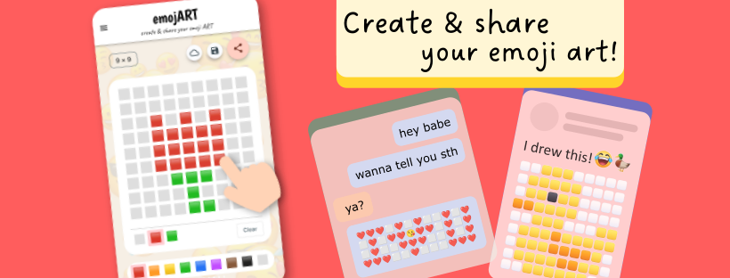
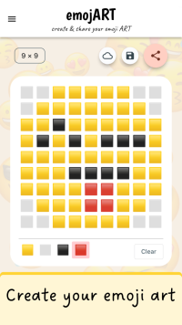
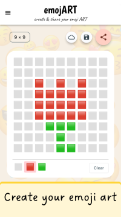
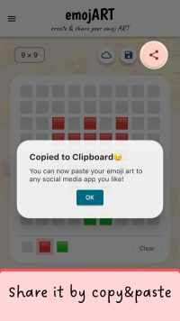
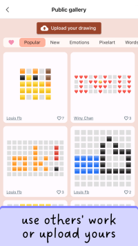
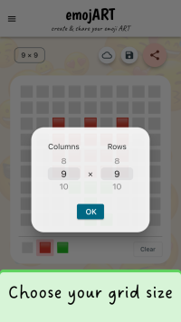
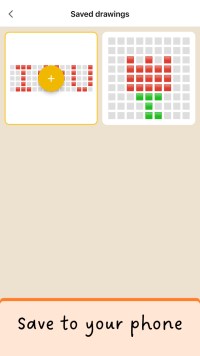
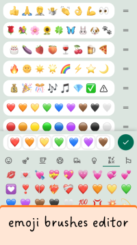

# emojART 

### Create and share emoji art with emojART!

Have you ever thought of creating pixel art with emojis? It's emoji art! With emojART, you can create emoji art by drawing on your device with emojis as brushes. You can copy and paste it on your favorite social media platform. You may express your emotion with emoji art on messenger apps or show off your creativity by posting emoji drawings on your wall!

Download emojART now and share your first emoji art with your loved ones!

&nbsp;&nbsp;&nbsp;  
  
 

Please also visit us on [our Facebook page](https://www.facebook.com/Emojart-100225549508331)

---
## Screenshots

---
Thanks for using emojART. For support or issue reports, please contact us via navonapps@outlook.com

